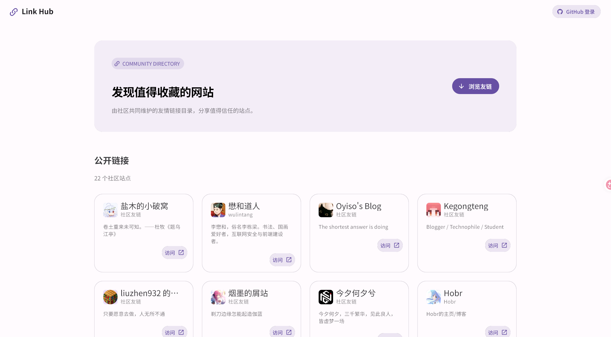
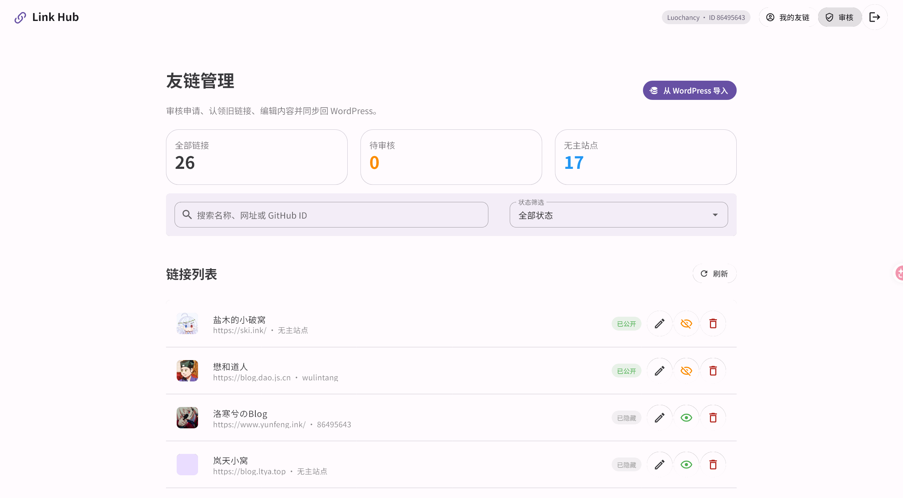

# LinkHub

一个以 **WordPress 友情链接为数据源**、运行在 **Cloudflare Workers** 上的友链展示与管理站。

LinkHub 提供公开友链目录、GitHub OAuth 登录、友链申请、管理员审核、WordPress 导入与双向同步，以及“管理员主动分配归属后，用户自助修改自己的友链”等功能。前端与 API 由同一个 Worker 提供，友链业务状态保存在 Workers KV，正式友链同步回 WordPress。

> 在线示例：[linkhub.luochancy.com](https://linkhub.luochancy.com/)





## 功能

- 公开展示状态为“已审核通过”的友情链接
- GitHub OAuth 登录与签名会话
- 登录用户提交友链申请
- 管理员审核、编辑、隐藏、恢复和删除友链
- 从 WordPress 一键导入现有友情链接
- 管理员通过 GitHub 数字 ID 主动分配旧友链归属
- 已获分配的用户在“我的友链”中自助修改
- 用户修改已公开友链后自动下架并进入待审核状态
- Cloudflare Workers KV 持久化，一条友链一个 Key
- WordPress REST API 同步
- Cloudflare Worker 后端与静态前端一体部署

## 使用流程

### 新友链申请

1. 用户通过 GitHub 登录。
2. 用户提交站点名称、URL、描述和头像。
3. 申请进入待审核状态。
4. 管理员审核通过后，LinkHub 将友链写入 WordPress 并公开展示。

### 旧友链分配与自助修改

本项目**不允许普通用户自行认领任意旧友链**：

1. 管理员从 WordPress 导入旧友链。
2. 用户把登录后页面显示的 GitHub 数字 ID 告诉管理员。
3. 管理员在管理后台编辑该友链，填写用户的 GitHub ID，主动完成分配。
4. 被分配的友链自动出现在该用户的“我的友链”页面。
5. 用户可自行修改名称、URL、描述和头像。
6. 已公开友链被用户修改后会暂时下架，等待管理员重新审核；审核通过后同步回 WordPress。

这样既支持用户自助维护，又避免任意用户冒领他人站点。

## 技术栈

- 前端：Vue 3、Vue Router、Vuetify 4、Vite
- API：Elysia、TypeScript
- 生产运行时：Cloudflare Workers
- 生产存储：Cloudflare Workers KV
- 本地运行时：Node.js、本地 JSON 文件
- 登录：GitHub OAuth
- 内容数据源：WordPress Links Manager + 配套 REST API 插件

## 目录结构

```text
.
├── index.html
├── static/                         # 前端静态源文件
├── src/
│   ├── client/                     # Vue 前端
│   └── server/                     # Elysia API、OAuth、存储和 WP 同步
├── scripts/                        # 图标生成及回归验证脚本
├── link-manager-api/
│   ├── link-manager-api.php        # WordPress 插件源码
│   └── readme.txt                  # WordPress 插件说明
├── link-manager-api-flat.zip       # 可直接上传的单文件插件包
├── docs/
│   ├── DEPLOYMENT.md                # Cloudflare、OAuth、变量与 WP 插件部署教程
│   └── images/                      # README 截图
├── wrangler.toml                   # 当前项目的 Cloudflare 部署配置
├── wrangler.toml.example           # 可供 Fork 使用的配置模板
└── .env.example                    # 本地环境变量模板
```

`public/` 是 `npm run build` 生成的前端产物，不应手工修改或提交。


## 部署与配套文档

生产部署、环境变量和 WordPress 插件说明已独立整理，避免 README 过长，也避免多份配置说明相互冲突：

- **[完整部署教程](docs/DEPLOYMENT.md)**：Cloudflare Workers、KV、GitHub OAuth、变量与 Secret、自动部署、部署验证和故障排查
- **[WordPress 插件说明](docs/DEPLOYMENT.md#wordpress-配套插件)**：安装、应用程序密码、REST API、字段、权限和所有权标记
- **[插件目录说明](link-manager-api/readme.txt)**：随插件源码提供的简版说明

最短生产部署流程：

1. 创建 Workers KV，并把 Namespace ID 写入 `wrangler.toml`；
2. 安装并启用配套 WordPress 插件；
3. 创建 GitHub OAuth App；
4. 在 Cloudflare 控制台填写运行时变量和 Secret；
5. 执行 `npm run build` 与 `npx wrangler deploy`。

> 请勿在 `wrangler.toml` 中添加 `[vars]`。运行时变量和 Secret 应由 Cloudflare 控制台管理，详细原因和完整清单见部署教程。

---

# 本地开发

## 环境变量

```bash
cp .env.example .env
```

编辑 `.env`。最小开发配置：

```dotenv
APP_URL=http://localhost:3000
GITHUB_CLIENT_ID=
GITHUB_CLIENT_SECRET=
GITHUB_REDIRECT_URI=http://localhost:3000/api/auth/callback
SESSION_SECRET=replace-with-a-random-secret-at-least-16-characters
SESSION_TTL=604800
ADMIN_GITHUB_IDS=
ADMIN_GITHUB_LOGINS=
WP_LINKS_URL=https://example.com/wp-json/link-manager/v1/links
WP_USERNAME=
WP_APPLICATION_PASSWORD=
PORT=3000
```

本地开发建议单独创建一个 GitHub OAuth App，并把它的回调地址设置为：

```text
http://localhost:3000/api/auth/callback
```

GitHub OAuth App 通常只配置一个回调地址；不要为了本地调试覆盖正在使用的生产回调。

## 启动

```bash
npm install
npm run dev
```

访问：<http://localhost:3000/>

本地数据保存在 `data/links.json`。该文件不应提交。

## 常用命令

```bash
npm run dev          # 启动前端监听和 Node API
npm run icons        # 重新扫描并生成按需 SVG 图标
npm run typecheck    # TypeScript 类型检查
npm run verify       # 回归、安全和部署配置检查
npm run build        # 生成生产前端并执行类型检查
npm run e2e:live     # 对已运行的本地服务执行真实 HTTP E2E
npm run start        # 运行已构建的本地 Node 服务
```

`src/client/icons.ts` 是生成文件，不要手工修改。模板中加入新的 `mdi-*` 图标后，`npm run icons` 或 `npm run build` 会自动更新它；未知图标会让构建失败，避免生产环境静默显示空白图标。

---

# API 与权限概览

| 路径 | 方法 | 权限 | 作用 |
|---|---|---|---|
| `/api/links` | GET | 公开 | 读取公开友链白名单字段 |
| `/api/links` | POST | 已登录 | 提交友链申请 |
| `/api/links/mine` | GET | 已登录 | 查看本人友链 |
| `/api/links/:id` | PUT | 所有者 | 修改本人友链并进入复审 |
| `/api/links/:id` | DELETE | 所有者 | 删除本人友链 |
| `/api/auth/github` | GET | 公开 | 发起 GitHub OAuth |
| `/api/auth/callback` | GET | OAuth | GitHub 回调 |
| `/api/auth/me` | GET | 公开 | 当前会话和管理员状态 |
| `/api/auth/logout` | POST | 已登录 | 退出登录 |
| `/api/admin/links` | GET | 管理员 | 获取全部记录 |
| `/api/admin/import` | POST | 管理员 | 从 WordPress 导入 |
| `/api/admin/:id` | PUT | 管理员 | 审核、编辑和分配归属 |
| `/api/admin/:id/visibility` | POST | 管理员 | 隐藏或恢复 |
| `/api/admin/:id` | DELETE | 管理员 | 删除记录并同步 WordPress |
| `/api/admin/storage` | GET | 管理员 | 查看旧存储迁移状态 |
| `/api/admin/migrate` | POST | 管理员 | 执行旧版 KV 结构迁移 |

公开接口不会返回 `ownerGithubId`、`wpId`、`syncError` 等内部字段。

## 部署与运维问题

“只有静态资产的 Worker”、登录失败、友情链接不显示、WordPress 导入失败或控制台变量被覆盖等问题，请参阅 **[部署教程的常见问题](docs/DEPLOYMENT.md#常见问题)**。

# License

请根据仓库中的许可证文件使用本项目；如果仓库尚未提供许可证，默认保留全部权利。